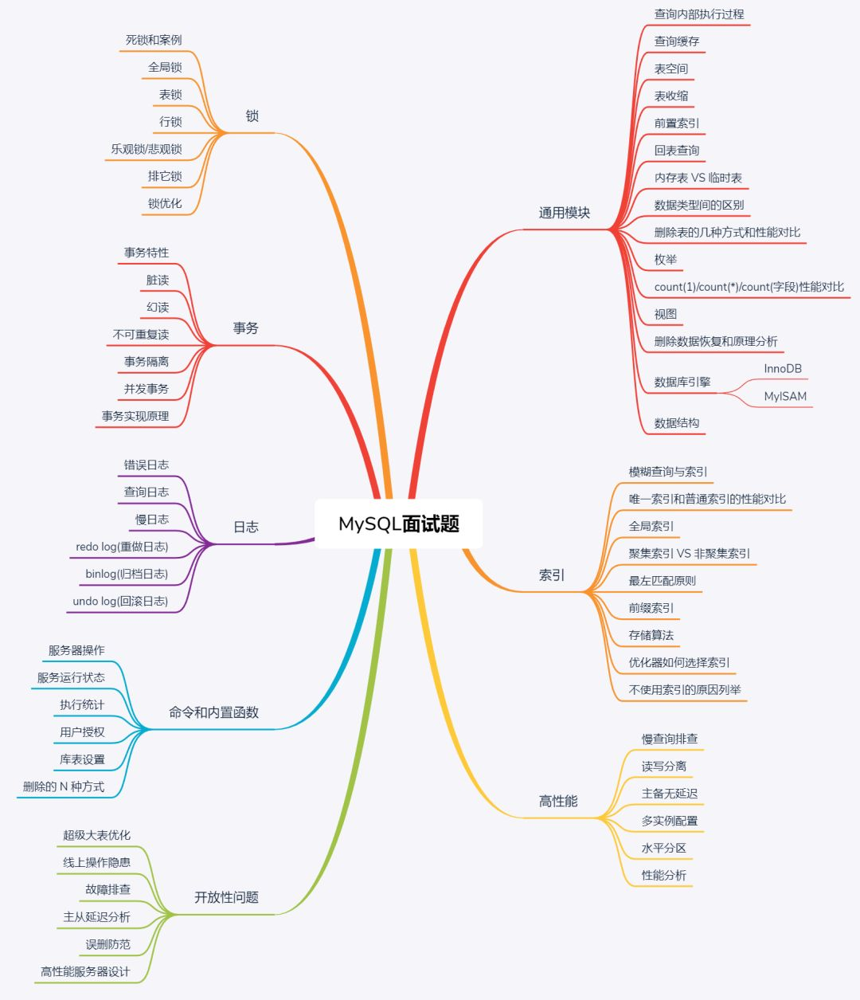

1.23-2.10

###  MYSQL 

| 一         | 二       | 三       | 四         | 五         | 六                   | 七           |
| ---------- | -------- | -------- | ---------- | ---------- | -------------------- | ------------ |
|            |          |          |            |            | 1.23：通用模块       | 1.24：索引   |
| 1.25：事务 | 1.26：锁 | 1.27：锁 | 1.28：日志 | 1.29：日志 | 1.30：命令和内置函数 | 1.31：高性能 |
| 2.1        | 2.2      | 2.3      | 2.4        | 2.5        | 2.6                  | 2.7          |

2.8-2.10

剩余三天查漏补缺

