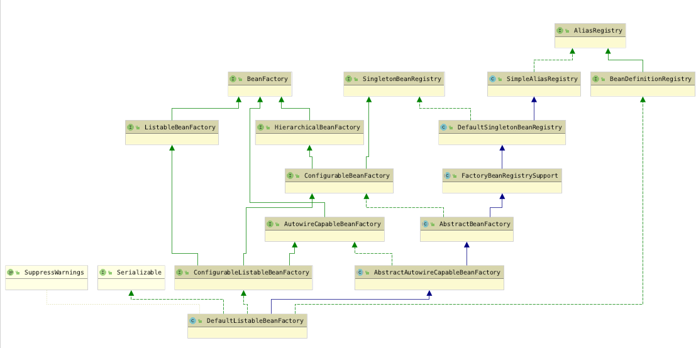

```
DefaultListableBeanFactory 是整个 bean加载的核心部分，是 Spring 注册及加载 巳an 的默认实现
```

```
XmlBeanFactory  继承于DefaultListableBeanFactmy；

对于 XmlBeanFactory与DefaultListableBeanFactory不同的地方其实是在 XmlBeanFactory 中使用了自定义的 XML读取器XmlBeanDefinitionReader ，实现了个性化的 BeanDefinitionReader读取;

DefaultListableBeanFactory继承了AbstractAutowireCapableBeanFactory 并实现了 ConfigurableListableBeanFactory 以及BeanDefinitionRegistry 接口
```




【interface】AliasRegistry: 定义对alias的简单增删改查等操作规范

【class】SimpeAliasRegistry: 实现了AliasRegistry接口，用一个ConcurrentHashMap作为alias的缓存.涉及alias的增删改查

【interface】 SingleBeanRegistry:  定义对单例的注册、获取、判断等方法规范

【interface】BeanFactory: 定义获取bean及相关属性的规范

【class】DefaultSingletonBeanResitry:   接口SingleBeanRegistry的默认实现，并且是唯一实现,

具体可见文章[2-DefaultSingletonBeanResitry.md](./2-DefaultSingletonBeanResitry.md)

