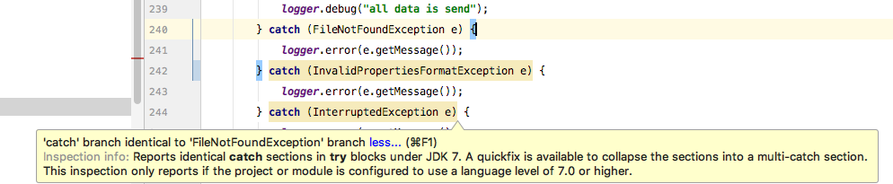

```
Field injection is not recommended less... (⌘F1) 
Inspection info: Spring Team recommends: "Always use constructor based dependency injection in your beans. Always use assertions for mandatory dependencies"
```

[推荐使用@Resource,不推荐使用@Autowired](https://www.cnblogs.com/RunForLove/p/7147318.html)

```
StringBuilder sb' can be replaced with 'String' less... (⌘F1) 
Inspection info: Reports any usages of StringBuffer, StringBuilder or StringJoiner which can be replaced with a single java.lang.String concatenation. Using a String concatenation makes the code shorter and simpler. This inspection only reports when the resulting concatenation is at least as efficient or more efficient than the original code.
```

<https://blog.csdn.net/liyaowen505/article/details/85164738>

```
Unchecked assignment: 'java.util.List' to 'java.util.List<com.jzuekk.light.kkblog.model.vo.ArticleEntryVo>' less... (⌘F1) 
Inspection info: Signals places where an unchecked warning is issued by the compiler, for example:

  void f(HashMap map) {
    map.put("key", "value");
  }
  
Hint: Pass -Xlint:unchecked to javac to get more details
```

```
local variable 'singleResult' is redundant less... (⌘F1) 
Inspection info: Reports unnecessary local variables, which add nothing to the comprehensibility of a method. Variables caught include local variables which are immediately returned, local variables that are immediately assigned to another variable and then not used, and local variables which always have the same value as another local variable or parameter
```

```
Cast may be removed by changing the type of 'principal' to 'User' less... (⌘F1) 
Inspection info: This inspection reports type casts which could be removed if the variable type is narrowed to the cast type. Example:
  Object x = "  string  ";
  System.out.println(((String)x).trim());
Here changing the type of x to String will make the cast redundant. The suggested quick-fix updates variable type and removes all redundant casts on that variable
```

```
Statement lambda can be replaced with expression lambda less... (⌘F1) 
Inspection info: This inspection reports lambda expressions with code block bodies when expression-style bodies can be use
```

```
Call to 'asList' with only one argument less... (⌘F1) 
Inspection info: Reports any calls to Arrays.asList() with zero arguments or only one argument. Such calls could be replaced with either a call to Collections.singletonList() or Collections.emptyList() which will save some memory.
Note: the list returned by Collections.singletonList() is immutable, while the list returned Arrays.asList() allows calling the set() method. This may break the code in rare cases.


问题示例：asList中至少要俩对象
From:
Arrays.asList("POST");
To:
Arrays.asList("POST", "GET", "DELETE", "PUT", "OPTIONS");
```

```java
Explicit type argument Category can be replaced with <> less... (⌘F1) 
Inspection info: This inspection reports all new expressions with type arguments which can be replaced with diamond type <>
Such <> syntax is not supported under Java 1.6 or earlier JVMs.
    
    
问题示例：
From:
response.setData(new PageView<Category>(categoryPage));
To:
response.setData(new PageView<>(categoryPage));
```


```
Generating equals/hashCode implementation but without a call to superclass, even though this class 
does not extend java.lang.Object. If this is intentional, add '@EqualsAndHashCode(callSuper=false)' 
to your type.


https://blog.csdn.net/feinifi/article/details/85275280
```


```
catch’ branch identical to ‘InstantiationException | IllegalAccessException’ branch less… (⌘F1)
Reports identical catch sections in try blocks under JDK 7. A quickfix is available to collapse the sections into a multi-catch section.
This inspection only reports if the project or module is configured to use a language level of 7.0 or higher.
```

在 try的代码块中，相同的catch块结构在JDK 7 以下比把这些块进行折叠到一个（**多catch块**）中要更有效。这个检查只在project或者module被配置使用JDK 7 或者更高的时候报告.


报警告的写法：



无警告写法：

