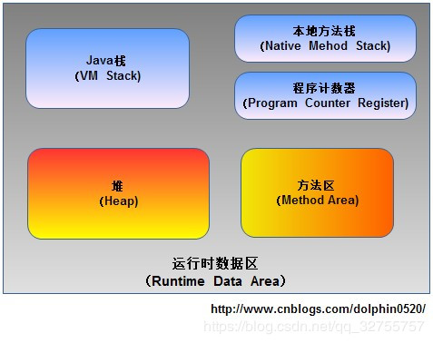

如上图所示，首先Java源代码文件(.java后缀)会被Java编译器编译为字节码文件(.class后缀)，然后由JVM中的类加载器加载各个类的字节码文件，加载完毕之后，交由JVM执行引擎执行。在整个程序执行过程中，JVM会用一段空间来存储程序执行期间需要用到的数据和相关信息，这段空间一般被称作为Runtime Data Area（运行时数据区），也就是我们常说的JVM内存。因此，在Java中我们常常说到的内存管理就是针对这段空间进行管理（如何分配和回收内存空间）


 


程序计数器PC 线程私有的 它可以看做是当前线程所执行的字节码的行号指示器 内存区域中唯一一个没有规定任何OutOfMemoryError的区域

Java虚拟机栈 线程私有的 每个方法在执行的同时都会创建一个栈帧，用于存储局部变量表、操作数栈、动态链接、方法出口等信息 如果线程请求的栈深度大于虚拟机所允许的深度，将抛出StackOverFlowError异常；如虚拟机扩展时仍无法申请到足够的内存，就会抛出OutOfMemoryError异常

本地方法栈 与虚拟机栈非常相似，区别是虚拟机栈为虚拟机执行Java方法服务，而本地方法栈则为虚拟机使用Native方法服务

```
也会抛出StackOverFlowError和OutOfMemoryError异常
```

Java堆 线程共享的 Java堆是GC管理的主要区域 在虚拟机启动时创建 存放对象实例，几乎所有的对象实例和数组都在这里分配内存。 如果在堆中没有内存完成实例分配，并且堆也无法再扩展时，将会抛出OutOfMemoryError异常

方法区 线程共享的 用于存储已被虚拟机加载的类信息、常量、静态变量、即使编译器编译后的代码等数据 当方法区无法满足内存分配需求时，将抛出OutOfMemoryError异常

运行时常量池 是方法区的一部分 用于存放编译器生成的各种字面量和符号引用 相对于Class文件常量池的一个重要特征是，具备动态性 运行时常量池是方法区的一部分，自然受到方法区内存的限制。当常量池无法再申请到内存时会抛出OutOfMemoryError异常