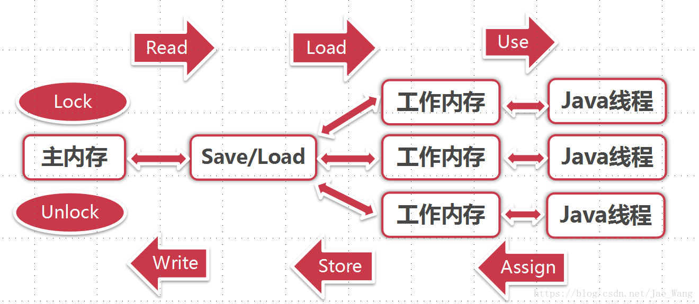

 lock（锁定）：作用于主内存的变量，把一个变量标识为一条线程独占状态。

unlock（解锁）：作用于主内存变量，把一个处于锁定状态的变量释放出来，释放后的变量才可以被其他线程锁定。

read（读取）：作用于主内存变量，把一个变量值从主内存传输到线程的工作内存中，以便随后的 load 动作使用

load（载入）：作用于工作内存的变量，把 read 操作从主内存中得到的变量值放入工作内存的变量副本中。

use（使用）：作用于工作内存的变量，把工作内存中的一个变量值传递给执行引擎，每当虚拟机遇到一个需要使用变量的值的字节码指令时将会执行这个操作。

assign（赋值）：作用于工作内存的变量，它把一个从执行引擎接收到的值赋值给工作内存的变量，每当虚拟机遇到一个给变量赋值的字节码指令时执行这个操作。

store（存储）：作用于工作内存的变量，把工作内存中的一个变量的值传送到主内存中，以便随后的 write 的操作。

write（写入）：作用于主内存的变量，它把 store 操作从工作内存中一个变量的值传送到主内存的变量中