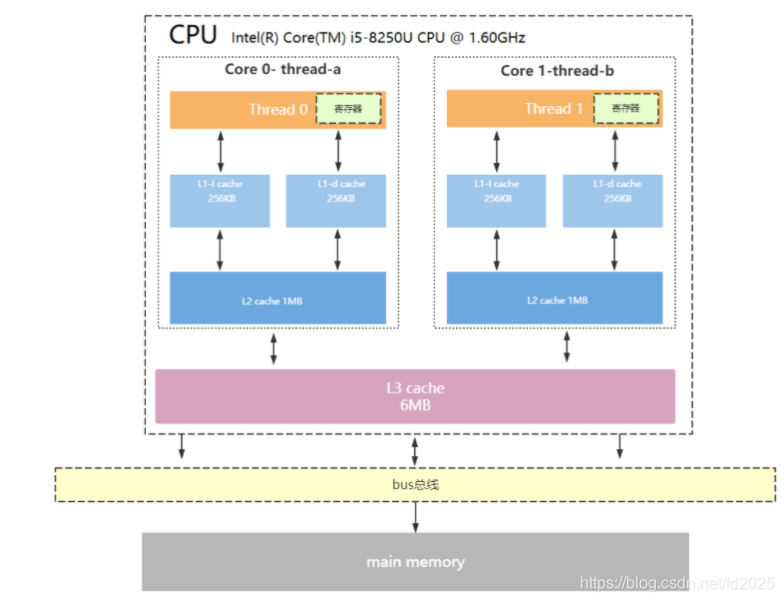

> 现代CPU为了提升执行效率，减少CPU与内存的交互(交互影响CPU效率)，一般在CPU上集成了多级缓存架构，常见的为三级缓存结构

- `L1 Cache`，分为数据缓存和指令缓存，逻辑核独占
- `L2 Cache`，物理核独占，逻辑核共享
- `L3 Cache`，所有物理核共享

#### cpu三级缓存架构

存储器存储空间大小：内存>L3>L2>L1>寄存器；
存储器速度快慢排序：寄存器>L1>L2>L3>内存；
什么是缓存行？
缓存是由最小的存储区块-缓存行(cacheline)组成，缓存行大小通常为64byte。

缓存行是什么意思呢？

比如你的L1缓存大小是512kb,而cacheline = 64byte,那么就是L1里有512 * 1024/64个cacheline

寄存器：

https://blog.csdn.net/Iamthedoctor123/article/details/84451724

基于栈的虚拟机和基于寄存器的虚拟机

https://blog.csdn.net/dashuniuniu/article/details/50347149