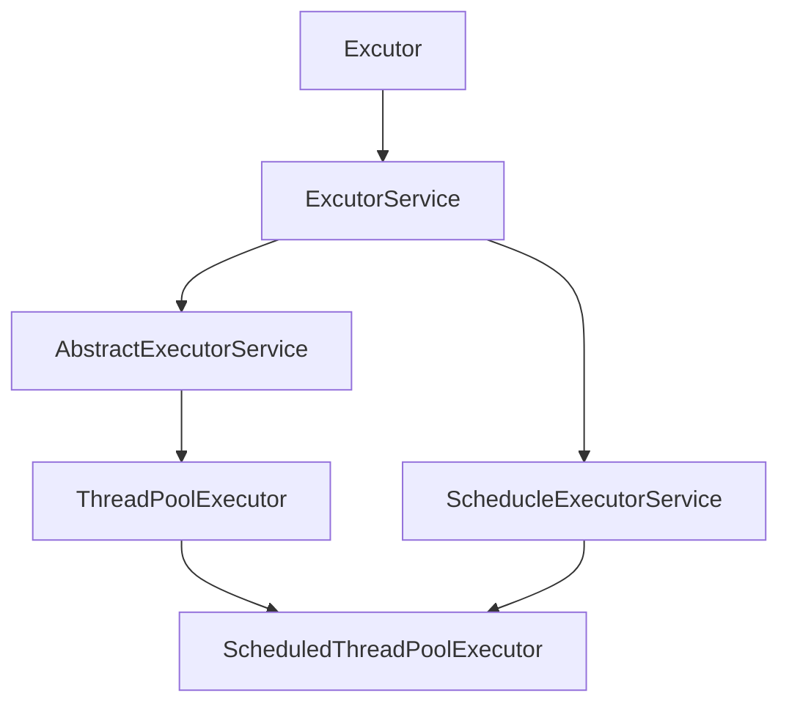

##  类关系图

```mermaid
graph TD

	A[Excutor] -->B[ExcutorService]

    B --> C[AbstractExecutorService]
    
    B --> D[ScheducleExecutorService]

	C --> E[ThreadPoolExecutor]
	
	E --> F[ScheduledThreadPoolExecutor]
	
	D --> F[ScheduledThreadPoolExecutor]
```

